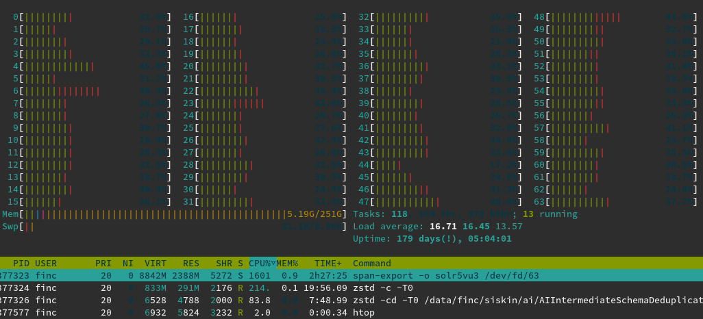

# Span


Span started as a single tool to convert [Crossref
API](https://www.crossref.org/services/metadata-delivery/rest-api/) data into a
[VuFind](https://github.com/vufind-org/vufind)/[SOLR
format](https://github.com/finc/index/blob/master/schema.xml) as used in
[finc](https://finc.info). An [intermediate
representation](https://github.com/ubleipzig/intermediateschema) for article
metadata is used for normalizing various input formats.
[Go](https://golang.org/) was choosen as the implementation language because it
is easy to deploy and has concurrency support built into the language. A basic
scatter-gather design allowed to process millions of records fast.

[](https://www.repostatus.org/#active)

While span has a few independent tools (like fetching or compacting
[crossref](https://www.crossref.org/) feeds), it is mostly used inside
[siskin](https://github.com/ubleipzig/siskin), a set of tasks to build an
aggregated index.

## Installation

    $ go install github.com/miku/span/cmd/...@latest

Span has frequent [releases](https://github.com/miku/span/releases), although
not all versions will be packaged as deb or rpm.

## Background

Initial import *Tue Feb 3 19:11:08 2015*, a single `span` command. In March
2015, `span-import` and `span-export` appeared.  There were some rudimentary
commands for dealing with holding files of various formats. In early 2016, a
licensing tool was briefly named `span-label` before becoming `span-tag`. In
Summer 2016, `span-check`, `span-deduplicate`, `span-redact` were added, later
a first man-page followed. In Summer 2017, `span-deduplicate` was gone, the
doi-based deduplication was split up between the blunt, but fast
[groupcover](https://github.com/miku/groupcover) and the generic
`span-update-labels`. A new `span-oa-filter` helped to mark open-access
records. In Winter 2017, a `span-freeze` was added to allow for fixed
configuration across dozens of files. The `span-crossref-snapshot` tool
replaced a sequence of luigi tasks responsible for creating a snapshot of
crossref data (the process has been summarized in [a
comment](https://github.com/datahq/awesome-data/issues/29#issuecomment-405089255)).
In Summer 2018, three new tools were added: `span-compare` for generating index
diffs for index update tickets, `span-review` for generating reports based on
SOLR queries and `span-webhookd` for triggering index reviews and ticket
updates through GitLab. During the development, new input and output formats
have been added. The parallel processing of records has been streamlined with
the help of a small library called
[parallel](https://github.com/miku/parallel). Since Winter 2017, the
[zek](https://github.com/miku/zek) struct generator takes care of the initial
screening of sources serialized as XML - making the process of mapping new data
sources easier.

Since about 2018, the span tools have seen mostly small fixes and additions.
Notable, since 2021, the previous scripts used to fetch daily metadata updates
from [crossref](https://api.crossref.org) has been put into a standalone tool, `span-crossref-sync`, which
merely adds some retry logic and consistent file naming to the API harvest.

## Documentation

See: manual [source](https://github.com/miku/span/blob/master/docs/span.md).

## Performance

In the best case no complete processing of the data should take more than two
hours or run slower than 20000 records/s. The most expensive part currently
seems to be the JSON
[serialization](https://raw.githubusercontent.com/miku/span/master/docs/span-import.0.1.253.png),
but we keep JSON for now for the sake of readability. Experiments with faster
JSON serializers and msgpack have been encouraging, a faster serialization
should be the next measure to improve performance.

Most tools that work on lines will try to use as many workers as CPU cores.
Except for `span-tag` - which needs to keep all holdings data in memory - all
tools work well in a low-memory environment.

More cores can help (but returns may diminsh): On a 64 core [2021
Xeon](https://ark.intel.com/content/www/de/de/ark/products/215274/intel-xeon-gold-6326-processor-24m-cache-2-90-ghz.html),
we find that e.g. `span-export` can process (decompression, deserialization,
conversion, serialization, compression) on average 130000 JSON documents/s. The
final pipeline stage (from normalized data to deduplicated and indexable data)
seems to take about three hours.



## Integration

The span tools are used in various tasks in siskin (which contains all
orchestration code). All span tools work fine standalone, and most will accept
input from stdin as well, allowing for one-off things like:

```shell
$ metha-cat http://oai.web | span-import -i name | span-tag -c amsl | span-export | solrbulk
```

## TODO

There is a [open issue](https://github.com/miku/span/issues/2) regarding more
flexible license labelling. While this would be useful, it would be probably
even more useful to separate content conversions from licensing issues
altogether. There is lots of work done in prototypes, which explore how fast
and how reliable we can rewrite documents in a production server.

Ideally, a cron job or trigger regularly checks and ensures compliance.
